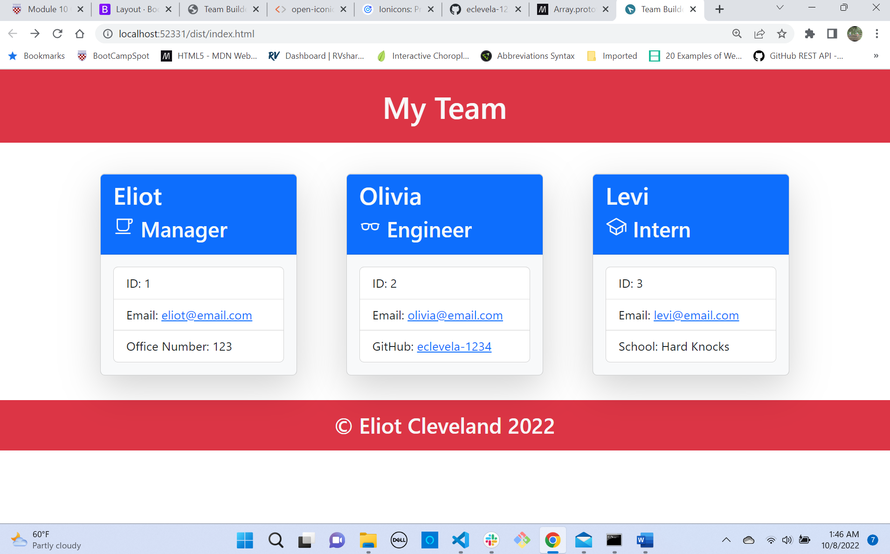

# My-Team-App

**This project uses object oriented programming to build a simple webpage to organize employees. It also uses test driven development (Jest) to quality check object methods. I completed this assignment out of order - just before the React unit. I think it was a great review because it hardened my understanding on objects and general data movement through file modules, while also forcing me to review basic front end development. All in all, pleased with the outcome. It worked on the first try!!!**

## Table of Contents

[Installation Instructions](#installation-instructions)

[Usage Information](#usage-information)

[Contribution Guidelines](#contribution-guidelines)

[Test Instructions](#test-instructions)

[Collaboration Credits](#collaboration-credits)

[Questions](#questions)

[License](#license)

## Installation Instructions

A node environment must be set up in order to install. Simply clone the repository and run npm install to install the modules. 
## Usage Information

Run node index to start the app. After you go through the prompts in the console, a webpage will be generated in the dist directory.
## Contribution Guidelines

For questions or to contribute please email me.
## Test Instructions

Run npm run test to run execute the test suites.
## Collaboration Credits

This assignment is part of a boot camp curriculum. Although it is a ground up build, some concepts have been borrowed from the lessons.
## Questions
For information about the developer, see my [GitHub Profile](https://github.com/eclevela-1234)

For general questions, please email me: eliothead@live.com
## License
Copyright (c)  2022 by [eclevela-1234](https://github.com/eclevela-1234)

MIT License

Permission is hereby granted, free of charge, to any person obtaining a copy
of this software and associated documentation files (the "Software"), to deal
in the Software without restriction, including without limitation the rights
to use, copy, modify, merge, publish, distribute, sublicense, and/or sell
copies of the Software, and to permit persons to whom the Software is
furnished to do so, subject to the following conditions:

The above copyright notice and this permission notice shall be included in all
copies or substantial portions of the Software.

THE SOFTWARE IS PROVIDED "AS IS", WITHOUT WARRANTY OF ANY KIND, EXPRESS OR
IMPLIED, INCLUDING BUT NOT LIMITED TO THE WARRANTIES OF MERCHANTABILITY,
FITNESS FOR A PARTICULAR PURPOSE AND NONINFRINGEMENT. IN NO EVENT SHALL THE
AUTHORS OR COPYRIGHT HOLDERS BE LIABLE FOR ANY CLAIM, DAMAGES OR OTHER
LIABILITY, WHETHER IN AN ACTION OF CONTRACT, TORT OR OTHERWISE, ARISING FROM,
OUT OF OR IN CONNECTION WITH THE SOFTWARE OR THE USE OR OTHER DEALINGS IN THE
SOFTWARE.

For more information visit https://opensource.org/licenses/MIT

